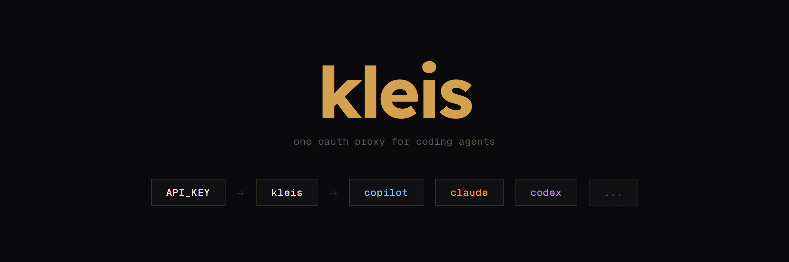

# Kleis

<p align="center">
  
</p>

OAuth account proxy for [OpenCode](https://github.com/sst/opencode). One base URL for Copilot, Codex, and Claude.

> [!NOTE]
> "Kleis" is named from the idea of a key that can unlock many paths with one handle.

Re-authenticating OAuth accounts across clients and machines is painful. Kleis stores credentials centrally, refreshes tokens automatically, and lets clients authenticate with simple API keys.

---

## How it works

Each provider has its own proxy adapter because none of them behave the same way. Copilot needs vision/initiator headers derived from message content analysis. Codex rejects certain params and requires instruction injection. Claude needs tool name prefixing, system identity rewriting, beta header merging, and streaming response transformation to strip those prefixes back out.

`GET /api.json` serves a models.dev-compatible registry that merges upstream model data with Kleis routing info, so OpenCode auto-discovers everything without manual model config.

There's also minute-bucketed request analytics across both API keys and provider accounts (non-blocking on the proxy path), and a small admin panel for managing accounts, keys, and token refreshes.

### Proxy routes

| Route | Provider | Endpoint |
|---|---|---|
| `POST /openai/v1/responses` | Codex | Responses API |
| `POST /anthropic/v1/messages` | Claude | Messages API |
| `POST /copilot/v1/chat/completions` | Copilot | Chat Completions |
| `POST /copilot/v1/responses` | Copilot | Responses API |

---

## Setup

```sh
bun install
```

Create `.env`:

```env
ADMIN_TOKEN=replace-with-a-long-random-token
TURSO_CONNECTION_URL=libsql://<your-db>.<region>.turso.io
TURSO_AUTH_TOKEN=<your-turso-token>
```

```sh
bun run db:migrate
bun run dev
```

Admin panel lives at `http://localhost:3000/admin/`.

---

## OAuth flows

- Codex: browser callback code flow or headless device flow.
- Copilot: device flow.
- Claude: authorization code flow (`claude.ai` or `console.anthropic.com` mode).

After connecting accounts, set one primary account per provider.

---

## OpenCode configuration

After creating an API key in the admin panel:

```env
OPENCODE_MODELS_URL=https://your-kleis-domain
KLEIS_API_KEY=your-issued-key
```

---

## Deploying to Vercel

Set `ADMIN_TOKEN`, `TURSO_CONNECTION_URL`, and `TURSO_AUTH_TOKEN` in your Vercel project, then deploy. Migrations run on build. Bun runtime.

Build pre-bundles everything into `dist/index.js` because Vercel's `@vercel/node` esbuild pass can't resolve extensionless TypeScript imports ([vercel/vercel#14910](https://github.com/vercel/vercel/issues/14910)) unless you use an experimental flag, which... breaks serving files from the `public` directory. Filed [vercel/vercel#15216](https://github.com/vercel/vercel/pull/15216) to fix this.

---

## Stack

Hono &middot; Turso (libSQL) &middot; Drizzle ORM &middot; Zod &middot; Bun
