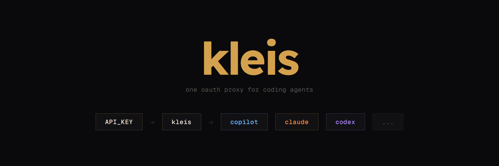

<p align="center">
  
</p>

OAuth account proxy for [OpenCode](https://github.com/anomalyco/opencode). One base URL for Copilot, Codex, and Claude.

> [!NOTE]
> "Kleis" is named from the idea of a key that can unlock many paths with one handle.

Re-authenticating OAuth accounts across clients and machines is painful. Kleis stores credentials centrally, refreshes tokens automatically, and lets clients authenticate with simple API keys.

---

## How it works

Each provider has its own proxy adapter because none of them behave the same way. Copilot needs vision/initiator headers derived from message content analysis. Codex rejects certain params and requires instruction injection. Claude needs tool name prefixing, system identity rewriting, beta header merging, and streaming response transformation to strip those prefixes back out.

`GET /api.json` serves a models.dev-compatible registry that merges upstream model data with Kleis routing info, so OpenCode auto-discovers everything without manual model config.

Each API key also gets a scoped discovery URL at `GET /api/<models-discovery-token>/api.json`, so model discovery can match that key's provider/model scopes.

There's also minute-bucketed request analytics across both API keys and provider accounts (non-blocking on the proxy path), and a small admin panel for managing accounts, keys, and token refreshes.

### Proxy routes

| Route | Provider | Endpoint |
|---|---|---|
| `POST /openai/v1/responses` | Codex | Responses API |
| `POST /anthropic/v1/messages` | Claude | Messages API |
| `POST /copilot/v1/chat/completions` | Copilot | Chat Completions |
| `POST /copilot/v1/responses` | Copilot | Responses API |

---

## Setup

```sh
bun install
```

Create `.env`:

```env
ADMIN_TOKEN=replace-with-a-long-random-token
CRON_SECRET=replace-with-a-long-random-token
TURSO_CONNECTION_URL=libsql://<your-db>.<region>.turso.io
TURSO_AUTH_TOKEN=<your-turso-token>
```

```sh
bun run db:migrate
bun run dev
```

Admin panel lives at `http://localhost:3000/admin/`.

---

## OAuth flows

- Codex: browser callback code flow or headless device flow.
- Copilot: device flow.
- Claude: authorization code flow (`claude.ai` or `console.anthropic.com` mode).

After connecting accounts, set one primary account per provider.

---

## OpenCode configuration

After creating an API key in the admin panel:

```env
OPENCODE_MODELS_URL=https://your-kleis-domain/api/<models-discovery-token>
KLEIS_API_KEY=your-issued-key
```

---

## Self-hosting

Set `ADMIN_TOKEN`, `CRON_SECRET`, `TURSO_CONNECTION_URL`, and `TURSO_AUTH_TOKEN`, then run:

```sh
bun run start
```

Run `bun run db:migrate` before first start and during deploys that include schema changes.

The Bun app serves `public/admin/` directly, so the admin UI works the same in local dev and production.

### Docker Compose

This repo includes a multi-stage `Dockerfile` and `docker-compose.yml` for local/self-hosted runs.

```sh
docker compose build
docker compose up -d
```

The Compose setup runs migrations in a one-shot `migrate` service before starting `app`, binds the app to `127.0.0.1:3000`, and includes a healthcheck against `/healthz`.

If you want to rerun migrations manually:

```sh
docker compose run --rm migrate
```

### Why not Vercel?

Kleis proxies long-lived streaming AI responses. On Vercel that means request and response bytes repeatedly move between the CDN and the function runtime, which can turn into expensive `Fast Origin Transfer` usage for a proxy-heavy workload.

Vercel also pushed this repo into a few platform-specific workarounds around bundling, static admin asset serving, cache tags, and background tasks. The current code intentionally removes those assumptions so the app behaves the same way on a normal Bun server.

For historical context, the earlier Vercel import/static-serving issue is documented in `vercel/vercel#14910`, and a fix was proposed in `vercel/vercel#15216`.

### Cron

For refreshing provider tokens, prefer an external scheduler that calls `GET /cron/refresh-provider-accounts` with `Authorization: Bearer $CRON_SECRET`. For a single VPS, a normal cron job or `systemd` timer is the simplest setup and avoids in-process scheduling edge cases.

---

## Stack

Hono &middot; Turso (libSQL) &middot; Drizzle ORM &middot; Zod &middot; Bun

---

## Acknowledgments

Provider proxy behavior is derived from [OpenCode](https://github.com/anomalyco/opencode) and [pi-mono](https://github.com/badlogic/pi-mono). Source references are pinned to specific commits throughout the codebase.
